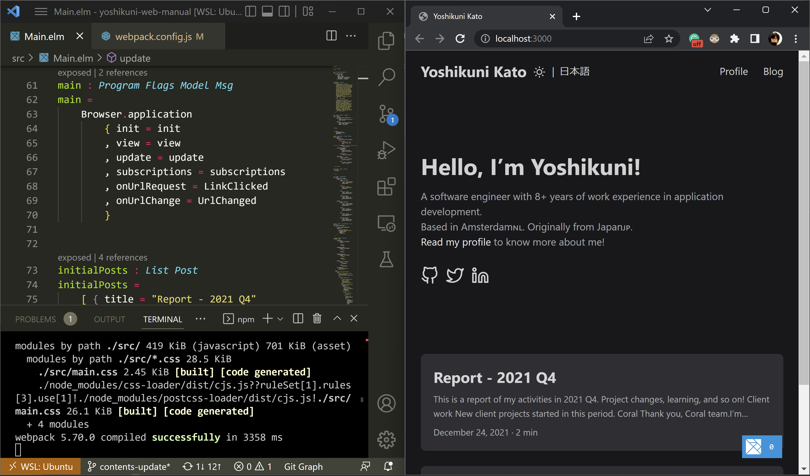

# yoshikuni-web-manual

This is a sample web app written in Elm + TailwindCSS.  



## Context
I built this site using Elm+TailwindCSS to demonstrate how I can build websites from scratch, without using site generators.  
For this purpose, contents and styles are copied from [my website](https://yoshikuni-web.com/) that is build using [Hugo](https://gohugo.io/). 

## Tech stacks
- [Elm](https://elm-lang.org/)
- [TailwindCSS](https://tailwindcss.com/)
- [webpack](https://webpack.js.org/)
- [Firebase Hosting](https://firebase.google.com/docs/hosting)

## Deploy
```sh
$ npm run deploy
```

## Links
- [My actual website](https://yoshikuni-web.com/) using Hugo
